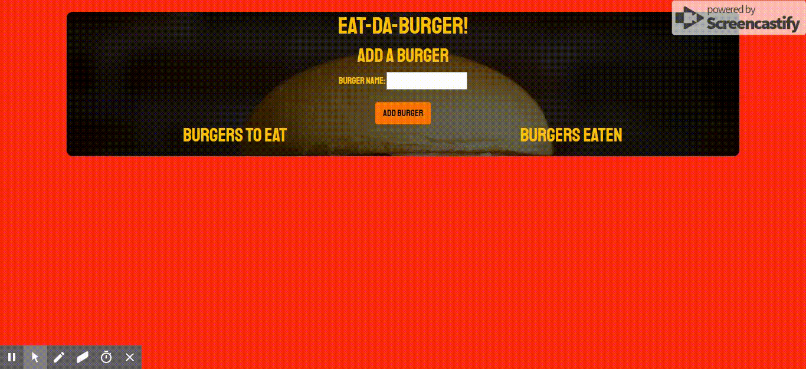

# Eat-Da-Burger

## Full-Stack Application Utilizing Express, Node, and a Self-created ORM

## Here Is How It Works

## Where Everything Is Stored

All the burgers and items added are stored inside of a mysql database and are queried and updated dynamically!

